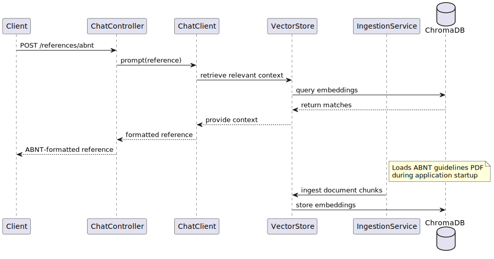

# ABNT Assistant RAG/OpenAI

A Spring Boot application that leverages Retrieval-Augmented Generation (RAG) to provide ABNT (Brazilian Technical Standards Association) bibliographic reference formatting assistance using OpenAI's GPT-4 model and ChromaDB for vector storage.

## Overview

This application serves as an intelligent assistant for formatting bibliographic references according to ABNT standards. It combines the power of Large Language Models (LLM) with local document knowledge through RAG, ensuring accurate and standard-compliant reference formatting.

## Architecture


## Endpoints

| EndPoint            | Method | Description                                                               |
|---------------------|:------:|---------------------------------------------------------------------------|
| /v2/rerefences/abnt |  POST  | Create a correct bibliographic reference, following ABNT style guidelines |

#### Example

> POST /v2/references/abnt

#### Body
````json lines
{
  "type": "article",
  "reference": "Machado, Regina. (2017).  Abordagem Triangular. Revista GEARTE, [S. l.], v. 4, n. 2. Disponível em: https://seer.ufrgs.br/index.php/gearte/article/view/75212. Acesso em: 01 maio. 2024. DOI: 10.22456/2357-9854.75212."
}
````
#### Response

`200 - OK`

````text lines
MACHADO, Regina. Abordagem Triangular. Revista GEARTE, [S. l.], v. 4, n. 2, 2017. Disponível em: https://seer.ufrgs.br/index.php/gearte/article/view/75212. Acesso em: 01 maio 2024. DOI: 10.22456/2357-9854.75212.
````

## Integrations

- **OpenAI GPT-4**: Used for natural language processing and reference formatting
- **ChromaDB**: Vector database for storing document embeddings
- **PDFBox**: For reading and processing PDF documents

## Key Properties

```properties
# OpenAI Configuration
spring.ai.openai.api-key=${OPENAI_API_KEY}
spring.ai.openai.chat.options.model=gpt-4

# ChromaDB Configuration
spring.ai.vectorstore.chroma.initialize-schema=true
spring.ai.vectorstore.chroma.collection-name=abnt-sytle-guideline
```

## Build & Run

### Build

In the root folder run the maven command to build all the microservices:

```
mvn clean package
```

### Build as a container

Access each microservice folder and execute the command to build the docker image:

```
docker build -f Dockerfile -t [SERVICE_NAME]:1.0.0 .
```

### Run as a container

After the docker image was created, execute the command to run the container:

```
docker run -d -p [PORT]:[PORT]  --env PROFILE=local -i -t [SERVICE_NAME]:1.0.0
```

### Run using docker compose

There is a project to run all microservices and the third party services using docker compose

First, in the root folder execute the command bellow to build the microservices and generate the jar files

```
mvn clean install
```

#### Build the images and run all the containers

```
docker-compose up
```

#### Stop the containers

```
docker-compose down --rmi all
```

## Technologies Used
* Spring Boot 3.4.2
* Spring AI
* Java 21
* ChromaDB
* OpenAI
